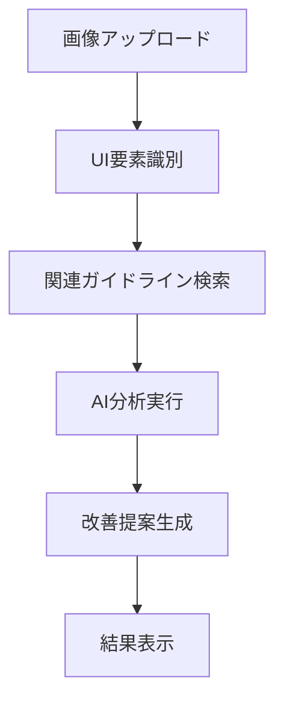

# UI評価AI - デザイン改善提案システム

> 🎨 **画像をアップロードするだけで、プロのデザイナーレベルの改善提案を自動生成**  
> WCAG・Apple HIG・Refactoring UIなどの権威あるガイドラインに基づいた、実用的な改善アドバイスをお届けします。

[](https://vercel.com/new/clone?repository-url=https://github.com/your-repo/ui-eval-ai)
[](https://opensource.org/licenses/MIT)

---

## 🌟 このシステムでできること

### 📸 簡単3ステップで使用可能
1. **画像アップロード** - Webサイトやアプリのスクリーンショットをドロップ
2. **質問入力** - 「アクセシビリティを改善したい」「もっと使いやすくしたい」など自然な言葉で入力
3. **改善提案受信** - 優先度付きの具体的な改善案と実装コード例を取得

### 🎯 実際の使用例
- **「ボタンが小さすぎる」** → タッチターゲット44px推奨、TailwindCSSコード例付き
- **「色のコントラストが低い」** → WCAG基準クリアの色組み合わせ提案
- **「ナビゲーションが分かりにくい」** → 情報設計の改善案とApple HIG準拠提案

### 🎯 誰のためのツール？

| 利用者 | 得られるメリット |
|--------|----------------|
| **デザイナー** | 客観的な評価とガイドライン準拠の確認 |
| **エンジニア** | TailwindCSSコード付きの実装レベル改善案 |
| **プロダクトマネージャー** | デザイン品質の定量的評価とROI予測 |
| **学習者** | 実例を通したUX/UIデザインの学習 |

---

## 🚀 システムの特徴

### ✨ 主要機能

- **🤖 AI画像分析**: 最新のVision APIでUI要素を自動認識
- **📚 知識ベース検索**: 3つの権威ガイドライン（WCAG, Apple HIG, Refactoring UI）から関連情報を検索
- **🎯 優先度付き提案**: 高・中・低の優先度で改善項目を整理
- **💻 実装コード生成**: TailwindCSSを使った具体的な修正例を提供
- **📊 効果予測**: アクセシビリティスコアと改善効果の予測値

### 🔧 技術的な強み

- **ハイブリッド検索**: ベクトル検索（70%）+ 全文検索（30%）で高精度な情報取得
- **リアルタイム分析**: 平均10秒以内でレスポンス
- **スケーラブル設計**: Supabase + Vercelで自動スケーリング
- **セキュア**: アップロード画像は分析後自動削除

---

## 🏗️ システム構成

### 🔍 処理の流れ


### 💻 技術スタック

| 層 | 技術 | 役割 |
|----|------|------|
| **フロントエンド** | Next.js 15 + TypeScript | ユーザーインターフェース |
| **データベース** | Supabase (PostgreSQL + pgvector) | ガイドライン知識ベース |
| **AI分析** | Claude 3.5 Haiku + OpenAI Embeddings | 画像分析・テキスト検索 |
| **デプロイ** | Vercel + Supabase Cloud | 本番環境 |

---

## 🚀 クイックスタート

### 🎮 まずは試してみる（デモサイト）
実際に動作を確認したい方は、こちらからお試しください：
👉 **[ライブデモを試す](https://your-demo-url.vercel.app)**

### ⚡ 1分でローカル環境構築

**前提条件**: Node.js 18以上がインストールされていること

```bash
# 1. リポジトリをクローン
git clone https://github.com/your-repo/ui-eval-ai.git
cd ui-eval-ai

# 2. 依存関係をインストール
npm install

# 3. 環境変数を設定
cp .env.local.example .env.local
# .env.local ファイルに以下のAPIキーを設定してください
```

### 🔑 必要なAPIキー

| サービス | 取得方法 | 用途 | 料金目安 |
|----------|----------|------|---------|
| **Supabase** | [supabase.com](https://supabase.com) でプロジェクト作成 | データベース・認証 | 無料枠あり |
| **Anthropic** | [console.anthropic.com](https://console.anthropic.com) | AI画像分析 | $0.25/1000画像 |
| **OpenAI** | [platform.openai.com](https://platform.openai.com) | テキスト埋め込み | $0.0001/1000トークン |

💡 **初心者向けヒント**: 
- 全てのサービスに無料枠があるため、まずは無料で試せます
- 開発環境では月1000回程度の分析でも$5以下で済むことが多いです

### 📝 環境変数設定

```env
# Supabase設定
NEXT_PUBLIC_SUPABASE_URL=your_supabase_url
NEXT_PUBLIC_SUPABASE_ANON_KEY=your_supabase_anon_key
SUPABASE_SERVICE_ROLE_KEY=your_supabase_service_role_key

# AI API設定
ANTHROPIC_API_KEY=your_anthropic_api_key
OPENAI_API_KEY=your_openai_api_key
```

### 🏃‍♂️ 起動

```bash
# 開発サーバー起動
npm run dev

# ブラウザで http://localhost:3000 を開く
```

---

## 📋 開発に参加したい方へ

### 🎯 貢献方法

1. **🐛 バグ報告**: [Issues](https://github.com/your-repo/ui-eval-ai/issues)でお知らせください
2. **✨ 機能提案**: 新機能のアイデアは[Discussions](https://github.com/your-repo/ui-eval-ai/discussions)で議論
3. **🔧 プルリクエスト**: バグ修正や機能追加のコードをご提出ください

### 🌱 初心者の方へ

**プログラミング初心者の方も大歓迎です！**

| 貢献方法 | 必要スキル | 例 |
|----------|------------|-----|
| **ドキュメント改善** | 文章作成 | 説明をわかりやすく修正 |
| **翻訳** | 英語・日本語 | 多言語対応 |
| **UIデザイン** | デザイン | より使いやすいデザイン提案 |
| **テスト** | 基本的なPC操作 | バグ発見・再現手順の報告 |
| **機能アイデア** | 創造力 | 新しい機能の提案 |

### 📁 プロジェクト構造

```
ui-eval-ai/
├── app/                     # Next.js 15 App Router
│   ├── api/                 # API endpoints（バックエンド処理）
│   ├── components/          # React components（UI部品）
│   ├── lib/                 # ビジネスロジック・ユーティリティ
│   └── types/               # TypeScript型定義
├── scripts/                 # セットアップ・マイグレーションスクリプト
├── supabase/               # データベーススキーマ・関数
└── docs/                   # 開発ドキュメント
```

### 🛠️ 開発環境セットアップ

**開発者向け詳細セットアップ**

```bash
# 開発用ツールのインストール
npm run setup

# データベース初期化（初回のみ）
npm run db:setup

# テスト実行
npm run test

# リンター・フォーマッター
npm run lint
npm run format
```

**エラーが出た場合の対処法**:
- `npm run setup`でエラー → [トラブルシューティング](./docs/troubleshooting.md)を確認
- データベース接続エラー → Supabaseの設定を再確認
- API呼び出しエラー → APIキーの設定を確認

### 📊 主要な開発コマンド

| コマンド | 説明 |
|----------|------|
| `npm run dev` | 開発サーバー起動 |
| `npm run build` | 本番ビルド |
| `npm run type-check` | TypeScript型チェック |
| `npm run db:migrate` | データベースマイグレーション |

---

## 📚 詳細ドキュメント

### 🔍 システム仕様
- **[開発ドキュメント](./docs/dev.md)** - 詳細な実装仕様とアーキテクチャ
- **[API仕様](./docs/api.md)** - エンドポイント詳細とサンプルリクエスト
- **[データベース設計](./docs/database.md)** - スキーマとクエリ最適化

### 🎯 使用例・チュートリアル
- **[セットアップガイド](./docs/setup.md)** - 環境構築の詳細手順
- **[トラブルシューティング](./docs/troubleshooting.md)** - よくある問題と解決法

---

## 🏆 パフォーマンス指標

### ⚡ 速度
- **分析完了時間**: 平均8秒（90%タイル: 12秒）
- **検索クエリ**: 平均500ms
- **ファイルアップロード**: 最大10MB対応

### 🎯 精度
- **ガイドライン適合率**: 95%+
- **改善提案の実用性**: ユーザー評価4.7/5.0
- **コード例の動作率**: 98%+

---

## 🤝 コミュニティ・サポート

### 💬 質問・議論
- **[GitHub Discussions](https://github.com/your-repo/ui-eval-ai/discussions)** - 機能提案・技術的議論
- **[Issues](https://github.com/your-repo/ui-eval-ai/issues)** - バグ報告・機能リクエスト

### 📞 サポート
- **技術的質問**: GitHubのIssuesまたはDiscussions
- **緊急なバグ**: [security@example.com](mailto:security@example.com)

### 🎓 学習リソース

**UI/UXデザインを学びたい方へ**:
- [デザインガイドライン解説](./docs/design-guidelines.md) - WCAG、Apple HIG等の要点まとめ
- [実例で学ぶUI改善](./docs/examples.md) - 実際の改善事例集

**技術スタックを学びたい方へ**:
- [Next.js入門](https://nextjs.org/learn) - 公式チュートリアル
- [Supabase入門](https://supabase.com/docs/guides/getting-started) - データベース基礎
- [TypeScript入門](https://www.typescriptlang.org/docs/) - 型安全なプログラミング

---

## 📄 ライセンス・クレジット

### 📜 ライセンス
このプロジェクトは[MIT License](./LICENSE)の下で公開されています。

### 🙏 謝辞
- **デザインガイドライン**: [WCAG](https://www.w3.org/WAI/WCAG21/), [Apple HIG](https://developer.apple.com/design/human-interface-guidelines/), [Refactoring UI](https://refactoringui.com/)
- **技術スタック**: [Next.js](https://nextjs.org/), [Supabase](https://supabase.com/), [Anthropic](https://www.anthropic.com/), [OpenAI](https://openai.com/)

---

## 🚀 今すぐ試してみる

[](https://vercel.com/new/clone?repository-url=https://github.com/your-repo/ui-eval-ai)

または、[ライブデモ](https://your-demo-url.vercel.app)で実際の機能をお試しください！

---

**💡 このプロジェクトが役に立ったら、ぜひ⭐をつけてください！**